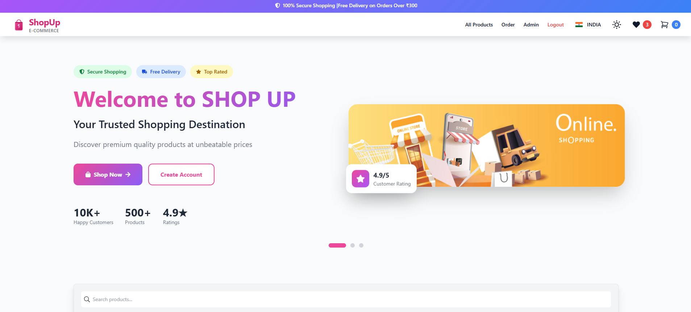
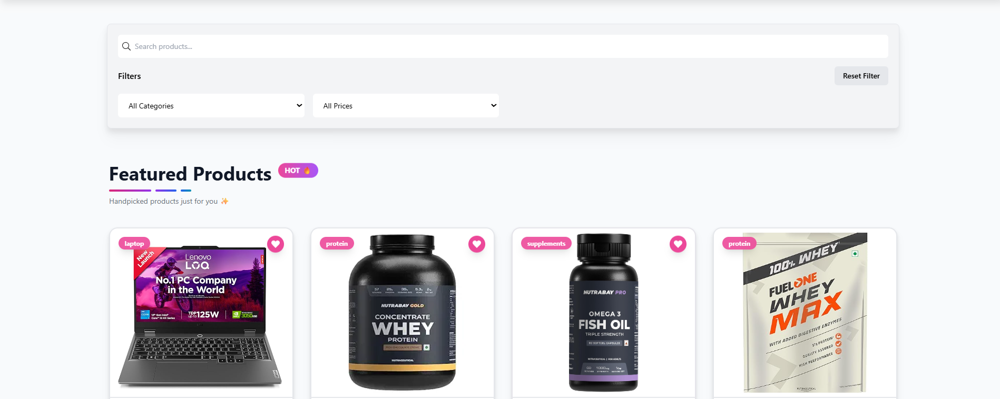
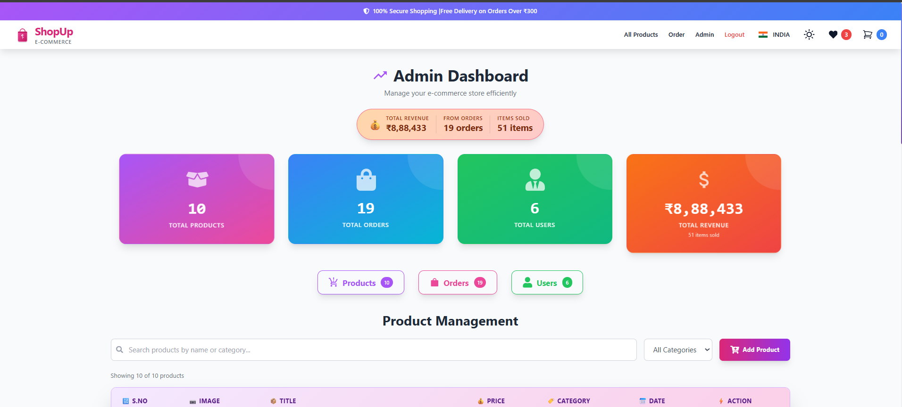
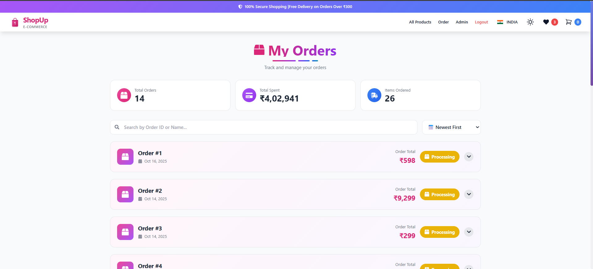
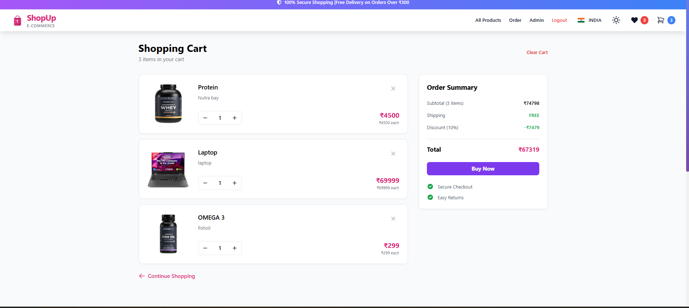
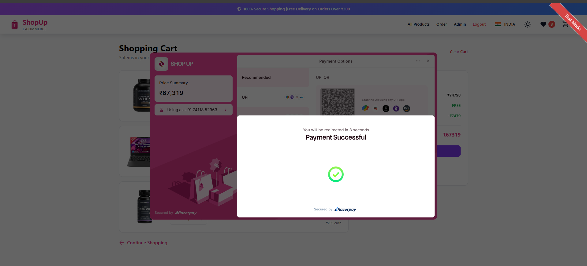

<div align="center">

# 🛍️ ShopUp

### Modern E-Commerce Platform

[](https://reactjs.org/)
[](https://firebase.google.com/)
[](https://tailwindcss.com/)
[](https://redux-toolkit.js.org/)

[Live Demo](https://shop-with-shopup.netlify.app/) • [Report Bug](https://github.com/SKSHAMKAUSHAL/E_SHOP_UP/issues) • [Request Feature](https://github.com/SKSHAMKAUSHAL/E_SHOP_UP/issues)

</div>

---

## ✨ Features

- 🔐 **Secure Authentication** - Firebase Auth with protected routes
- 🛒 **Smart Shopping Cart** - Redux-powered state management
- 💳 **Payment Integration** - Razorpay checkout
- 👨‍💼 **Admin Dashboard** - Complete product & order management
- 🌓 **Dark Mode** - Seamless theme switching
- 📱 **Fully Responsive** - Mobile-first design
- 🎨 **Modern UI** - Tailwind CSS with smooth animations
- ❤️ **Wishlist** - Save favorite products
- 🔍 **Advanced Filters** - Search & filter products easily

## 🚀 Quick Start

```bash
# Clone the repository
git clone https://github.com/SKSHAMKAUSHAL/E_SHOP_UP.git

# Navigate to directory
cd E_SHOP_UP

# Install dependencies
npm install

# Create .env file and add Firebase config
VITE_API_KEY=your_firebase_api_key
VITE_AUTH_DOMAIN=your_auth_domain
VITE_PROJECT_ID=your_project_id
VITE_STORAGE_BUCKET=your_storage_bucket
VITE_MESSAGING_SENDER_ID=your_sender_id
VITE_APP_ID=your_app_id

# Start development server
npm run dev
```

## 🛠️ Tech Stack

**Frontend:**
- React 18 + Vite
- Redux Toolkit
- Tailwind CSS
- React Router DOM

**Backend:**
- Firebase Firestore
- Firebase Authentication
- Firebase Storage

**Payment:**
- Razorpay Integration

## 📂 Project Structure

```
src/
├── components/         # Reusable UI components
├── pages/             # Page components & routes
├── context/           # Global state management
├── redux/             # Redux store & slices
├── fireabase/         # Firebase configuration
└── utils/             # Helper functions
```

## 🔒 Firebase Setup

1. Create a Firebase project at [Firebase Console](https://console.firebase.google.com/)
2. Enable **Authentication** (Email/Password)
3. Enable **Firestore Database**
4. Add your Firebase config to `.env` file

### Firestore Security Rules

```javascript
rules_version = '2';
service cloud.firestore {
  match /databases/{database}/documents {
    match /products/{document=**} {
      allow read: if true;
      allow write: if request.auth != null;
    }
    match /orders/{document=**} {
      allow read, write: if request.auth != null;
    }
    match /users/{userId} {
      allow read, write: if request.auth != null && request.auth.uid == userId;
    }
  }
}
```

## 👨‍💼 Admin Access

Update admin email in `src/App.jsx`:

```javascript
if (admin?.user?.email === 'your-admin-email@gmail.com') {
  return children;
}
```

## 📜 Available Scripts

| Command | Description |
|---------|-------------|
| `npm run dev` | Start development server |
| `npm run build` | Build for production |
| `npm run preview` | Preview production build |
| `npm run lint` | Run ESLint |

## 🌐 Deployment

### Netlify (Recommended)

```bash
npm run build
# Deploy dist/ folder to Netlify
```

Or connect your GitHub repository to Netlify for automatic deployments.

## 📸 Screenshots

<div align="center">
  
</div>

<div align="center">
  
</div>

<div align="center">
  
</div>

<div align="center">
  
</div>

<div align="center">
  
</div>

<div align="center">
  
</div>
## 🤝 Contributing

Contributions are welcome! Feel free to:

1. Fork the project
2. Create your feature branch (`git checkout -b feature/AmazingFeature`)
3. Commit your changes (`git commit -m 'Add some AmazingFeature'`)
4. Push to the branch (`git push origin feature/AmazingFeature`)
5. Open a Pull Request

## 📝 License

This project is licensed under the MIT License - see the [LICENSE](LICENSE) file for details.

## 👨‍💻 Author

**Sham Kaushal**

- GitHub: [@SKSHAMKAUSHAL](https://github.com/SKSHAMKAUSHAL)
- Email: skshamkaushal@gmail.com

## ⭐ Show your support

Give a ⭐️ if this project helped you!

---

<div align="center">
Made with ❤️ by Sham Kaushal
</div>
